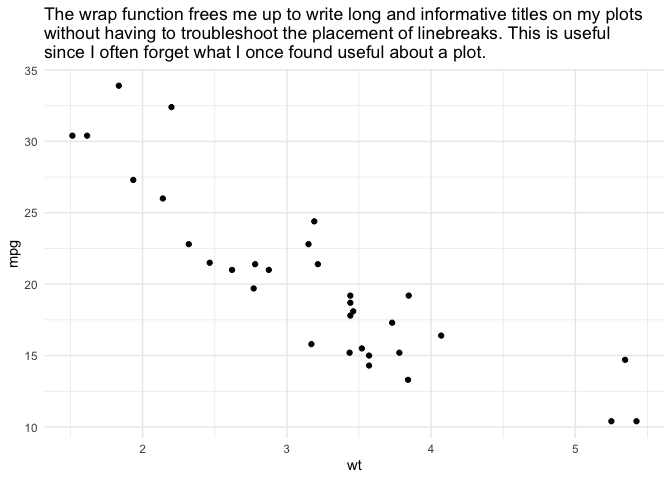

Who should you use breadcrumbs?
================
2019-12-20

If you hate being unable to find code and data in old data projects, you
may find `breadcrumbs` to be a breath of fresh air.

The goal for the `breadcrumbs` package is to provide a routine structure
to R projects so that you put code and data in the right places and find
them later with ease. `breadcrumbs` also encourages you to coordinate
your code and data with Makefile(s), which are a wonderful resource for
reproducibile workflows.

### Getting started

To get started using `breadcrumbs`  
1\. open a new or existing R project  
2\. Load the breadcrumbs package `library(breadcrumbs)`  
2\. Execute the `create_project_directories()` function in your console

You will now see a standard set of subdirectories appear in your project
directory.

#### The subdirectory structure

`<project>_cloud_dir/` I use the `<project>_cloud_dir/` to save large
files like data and image-laden reports that don’t belong in GitHub. I
recommend you sync this folder to the cloud via Google Drive or Box so
that it is backed up off your local machine.  
….`reports/` to store finished reports and presentations  
….`data/` to store processed data  
……..`raw/` to store raw data  
`R/` to store your functions  
`munge/` to store scripts that output processed data  
`analysis/` to store your analysis scripts

`breadcrumbs` is filled with functions to support the use of these
subdirectories. For instance, I have found it useful to save my
filepaths to commonly used subdirectories in a dedicated script called
“file\_paths.R”. The function `source_file_paths()` will execute this
script, and I include this function at the top of all my other scripts
and Rmd files.

#### Makefiles

`create_project_directories()` has also added a Makefile to your
project’s home directory. This Makefile can be used to make your
entire project reproducible from raw data to finished reports. For more
details on how to use Makefiles see the appendix in the Makefile
template generated by breadcrumbs.

### Other useful functions

#### wrap()

In addition to directory structure, `breadcrumbs` includes a number of
functions I find useful at the exploratory stage of data projects. For
instance `wrap()` will control the width of long ggplot titles and
facilitate your writing accurate and informative titles on all your EDA
plots without fussing around trying to find the right places to manually
insert line breaks.

``` r
library(breadcrumbs)
library(tidyverse)

ggplot(mtcars, aes(x = wt, y = mpg)) + 
    geom_point() + 
    labs(title = wrap("The wrap function frees me up to write long and informative titles on my plots without having to troubleshoot the placement of linebreaks. This is useful since I often forget what I once found useful about a plot.", 80)) + 
    theme_minimal()
```

<!-- -->

#### clean\_names()

Another useful function is `clean_names()`. I use `clean_names()` the
first time I import raw data to remove capital letters and illegal
characters. I’ll read in a government dataset below to demonstrate. Note
how illegal names like `JURISDICTION NAME` become clean snake\_case
names like `jurisdiction_name`. This is a great step to take at the
start of your project so you don’t need to remember esoteric conventions
about how variables were names in different datasets.

``` r
file_nyc_data <- 
    "https://data.cityofnewyork.us/api/views/kku6-nxdu/rows.csv"

# Reading data without clean_names()
read_csv(file_nyc_data) %>% select(1:4)
```

    ## # A tibble: 236 x 4
    ##    `JURISDICTION NAME` `COUNT PARTICIPANTS` `COUNT FEMALE` `PERCENT FEMALE`
    ##                  <dbl>                <dbl>          <dbl>            <dbl>
    ##  1               10001                   44             22             0.5 
    ##  2               10002                   35             19             0.54
    ##  3               10003                    1              1             1   
    ##  4               10004                    0              0             0   
    ##  5               10005                    2              2             1   
    ##  6               10006                    6              2             0.33
    ##  7               10007                    1              0             0   
    ##  8               10009                    2              0             0   
    ##  9               10010                    0              0             0   
    ## 10               10011                    3              2             0.67
    ## # … with 226 more rows

``` r
# Reading data with clean_names()
read_csv(file_nyc_data) %>% select(1:4) %>% clean_names()
```

    ## # A tibble: 236 x 4
    ##    jurisdiction_name count_participants count_female percent_female
    ##                <dbl>              <dbl>        <dbl>          <dbl>
    ##  1             10001                 44           22           0.5 
    ##  2             10002                 35           19           0.54
    ##  3             10003                  1            1           1   
    ##  4             10004                  0            0           0   
    ##  5             10005                  2            2           1   
    ##  6             10006                  6            2           0.33
    ##  7             10007                  1            0           0   
    ##  8             10009                  2            0           0   
    ##  9             10010                  0            0           0   
    ## 10             10011                  3            2           0.67
    ## # … with 226 more rows
